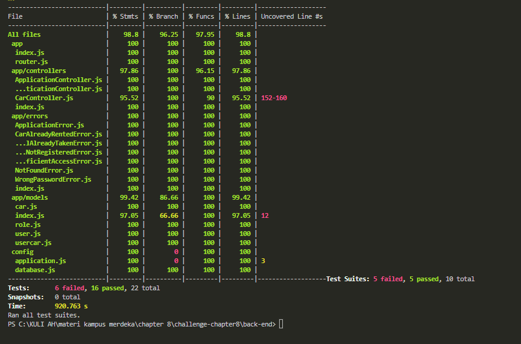

### BCR API
### CHALLENGE CHAPTER 8 BINAR ACADEMY

### Application Deployment Url At Heroku

[Challenge Chapter 8 Deployment](https://challenge-chapter8-yudhagana.herokuapp.com)

### Unit Testing File Coverage with test


## How To Run


Install All Package modules :

```
npm install
```

Database Operation :

```
npx sequelize db:create
```
```
npx sequelize db:migrate
```
```
npx sequelize db:seed:all
```

Database Operation :

```
npx sequelize db:create
```

Testing Operation :
```
npm run test
```


### Challenge Chapter 8 Milestones
Di dalam repository ini terdapat implementasi API dari Binar Car Rental.
Tugas kalian disini adalah:
1. Fork repository
2. Tulis unit test di dalam repository ini menggunakan `jest`.
3. Coverage minimal 70%
